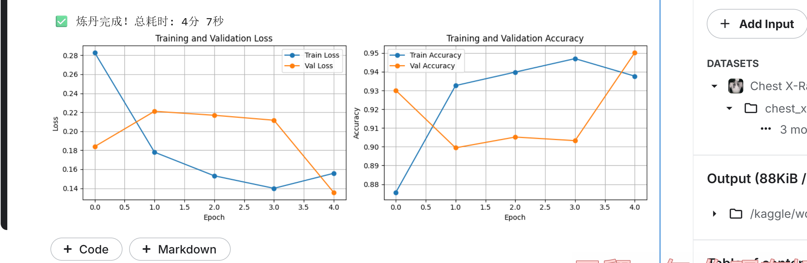
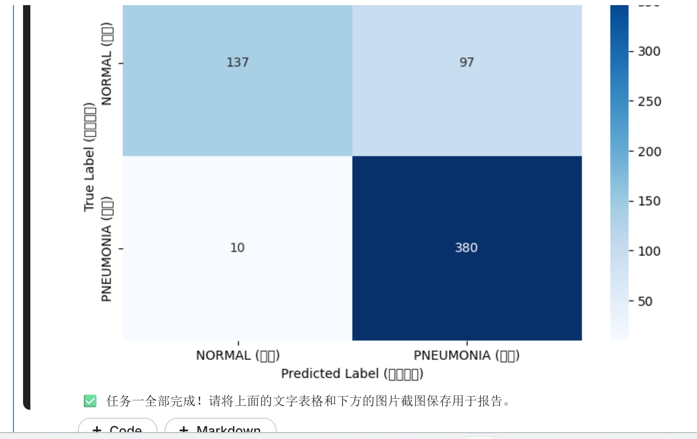

# 肺炎 X 光影像二分类实战 (HW07) - 实验报告

## 1. 数据集统计与划分
本实验弃用了原始数据集中样本极度匮乏的 `val` 文件夹。为保证模型评估的科学性，使用 `torch.utils.data.Subset` 对原 `train` 目录按 8:2 重新划分，并在训练集上应用了随机水平翻转 (`RandomHorizontalFlip`) 和随机旋转 (`RandomRotation`) 等数据增强技术以缓解过拟合。
最终数据集样本分布如下：
- **训练集 (Training Set):** 4172 张
- **验证集 (Validation Set):** 1044 张
- **测试集 (Test Set):** 624 张

## 2. 模型结构与超参数
本实验采用**迁移学习 (Transfer Learning)** 策略。
- **特征提取器：** 引入 ImageNet 预训练的 `ResNet50` 模型，冻结其所有底层卷积层参数，保留其强大的基础视觉特征提取能力。
- **分类器微调：** 替换最后的全连接层 (`model.fc`)，将其输出维度修改为 2（NORMAL, PNEUMONIA）。
- **超参数设置：**
  - **Loss Function:** CrossEntropyLoss
  - **Optimizer:** Adam
  - **Learning Rate:** 0.001
  - **Batch Size:** 32
  - **Epochs:** 5

## 3. 训练过程与测试结果
模型训练 5 轮后，在验证集上达到了最高 95.02% 的准确率。

### 3.1 训练/验证曲线

### 3.2 测试集评估指标
在完全未见过的 624 张测试集影像上，模型表现如下：

| 类别 | Precision (精确率) | Recall (召回率) | F1-Score | 样本量 (Support) |
| :--- | :---: | :---: | :---: | :---: |
| **NORMAL (正常)** | 0.9320 | 0.5855 | 0.7192 | 234 |
| **PNEUMONIA (肺炎)** | 0.7966 | **0.9744** | 0.8766 | 390 |
| **总体准确率 (Accuracy)** | \multicolumn{4}{c|}{**82.85%**} |

### 3.3 混淆矩阵 (Confusion Matrix)

- **True Positive (患病判患病):** 380 例
- **True Negative (正常判正常):** 137 例
- **False Positive (正常判患病):** 97 例
- **False Negative (患病判正常):** 10 例

---

## 4. 任务二：结果分析与思考

**1. 模型在 test 集上是否出现了高准确率但召回率偏低（或相反）的情况？从医学诊断角度，哪个指标更重要？**
**分析：** 从测试结果可以明显看出，肺炎类别的召回率极高（97.44%），但正常类别的召回率较低（58.55%），同时产生了 97 例假阳性，这意味着模型更倾向于给出“肺炎”的预测。
从临床医学诊断的角度来看，**召回率（Recall）远比精确率重要**。在严重疾病筛查中，首要目标是“不漏诊”。

**2. 如果模型将一张肺炎误判为正常（假阴性），可能带来什么后果？反之呢？**
**分析：** 
- **假阴性（肺炎判为正常）：** 后果极其严重。患者会被告知健康并遣返回家，导致延误最佳治疗时机，病情可能迅速恶化甚至危及生命。本模型在此项上表现极佳，390 例真实肺炎中**仅漏判了 10 例**。
- **假阳性（正常判为肺炎）：** 也就是本模型出现了 97 例的情况。其后果仅仅是让健康的患者产生短暂的虚惊，并额外增加一次复查（如进行更高精度的胸部 CT 或验血）以排除嫌疑，成本极低。
**结论：** 本模型采取了“宁可多做复查，不可漏掉一例”的保守策略，这种高召回率特性使其具备了极高的真实临床辅助诊断价值。
 
**3. 数据增强与迁移学习对结果是否有帮助？**
**分析：** 帮助极大。医学影像通常存在数据量少、获取成本高的问题。数据增强通过翻转、旋转扩充了样本多样性，有效防止了模型死记硬背。而直接借用 ResNet50 的预训练权重，使得模型不需要从零开始学习何为“边缘”和“纹理”，只需 5 轮极短时间的训练，就在验证集上突破了 95% 的准确率，极大降低了算力成本并提升了收敛速度。